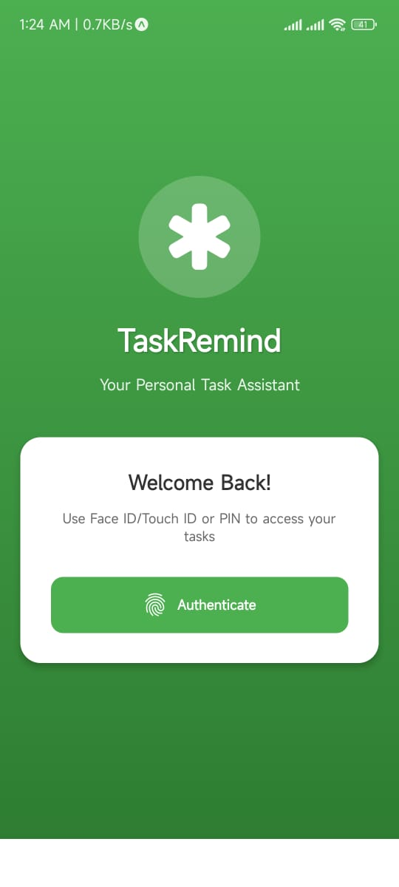
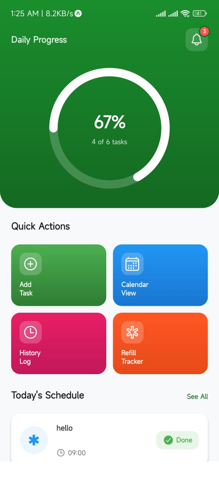
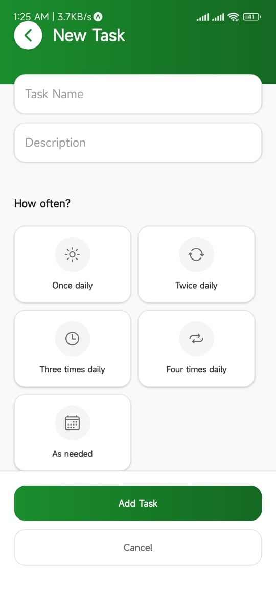
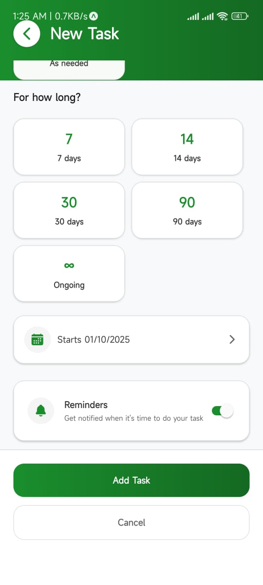
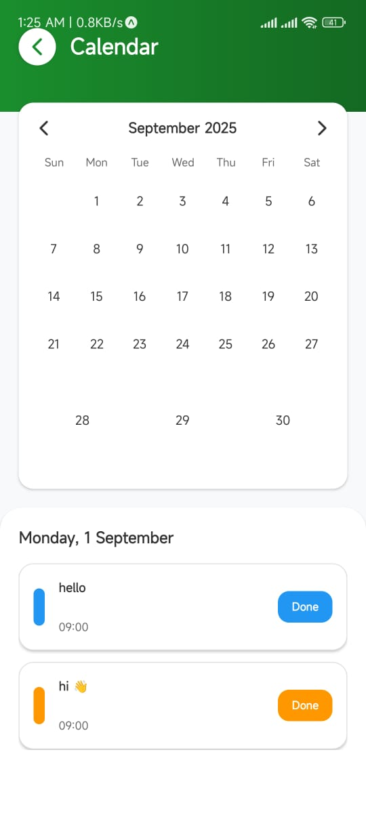
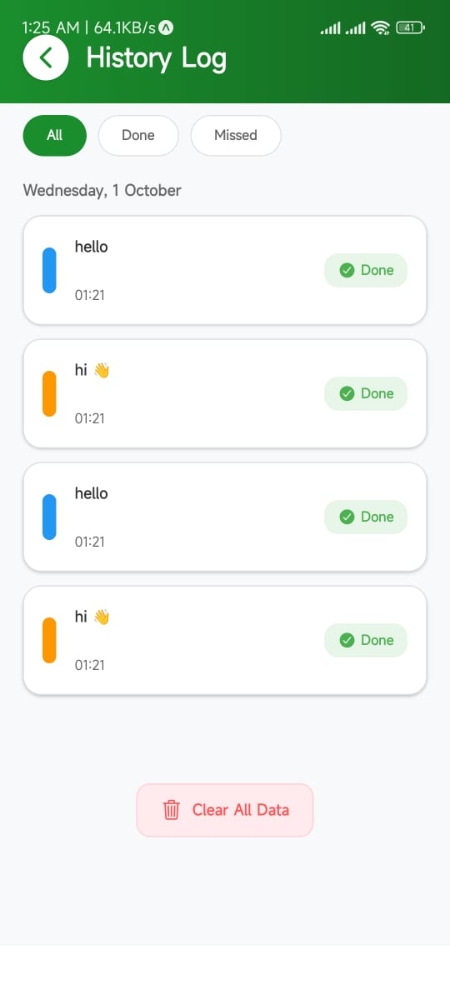
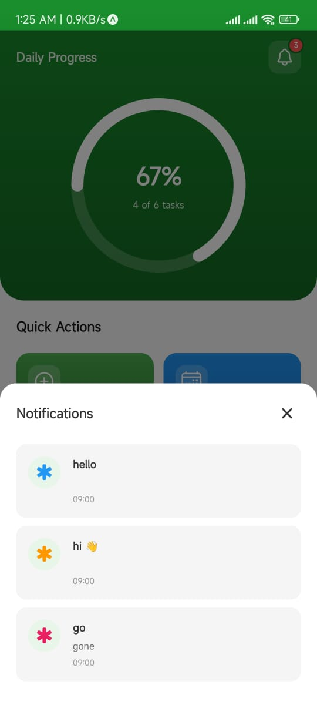

# Task Reminder App

A comprehensive offline mobile application for managing task reminders, built with React Native and Expo.

## Features

- **Offline Functionality**: Works completely offline, storing all data locally on your device
- **Task Reminders**: Set up reminders for your tasks with customizable schedules
- **Calendar View**: View your task schedule in a calendar format
- **History Tracking**: Keep track of completed tasks and missed deadlines
- **Refill Management**: Monitor and manage recurring task refills
- **Task Management**: Add and organize your tasks
- **Notifications**: Receive timely reminders for your tasks
- **Secure Storage**: All data is stored securely using device storage
- **Cross-Platform**: Runs on iOS and Android devices

## How to Run the Project

### Prerequisites

- Node.js (version 18 or higher)
- npm or yarn
- Expo CLI

### Installation

1. Clone the repository:
   ```bash
   git clone https://github.com/mihf05/Task-reminder-app.git
   cd Task-reminder-app
   ```

2. Install dependencies:
   ```bash
   npm install
   ```

3. Start the development server:
   ```bash
   npx expo start
   ```

4. Run on your device:
   - For Android: `npm run android`
   - For iOS: `npm run ios`
   - For Web: `npm run web`

## Demo Screenshots

|  |  |  |  |
| :----------------------------------------: | :----------------------------------------: | :----------------------------------------: | :----------------------------------------: |
|         Square with Phone Lock         |              Dashboard Page                |               ADD TASK               |            Task Page Bottom             |

|  |  |  |  |
| :----------------------------------------: | :----------------------------------------: | :----------------------------------------: | :----------------------------------------: |
|    Task Showing with Interactive Calendar View    |               History Log                  |              Notification                 |                   |

## Technologies Used

- React Native
- Expo
- TypeScript
- AsyncStorage for local data persistence
- Expo Notifications for reminders

## Contributing

1. Fork the repository
2. Create a feature branch
3. Make your changes
4. Test thoroughly
5. Submit a pull request
